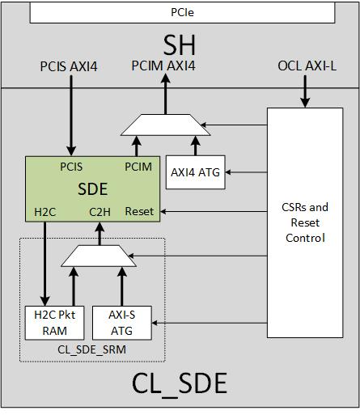

# CL_SDE Custom Logic Example

## Table of Contents

1. [Overview](#Overview)
2. [Functional Description](#FuncDesc)
3. [Interfaces and Address Range](#Interfaces)
3. [Software](#Software)
3. [Metadata](#Metadata)

## Overview
The CL_SDE example implements the FPGA custom logic used to generate the AFI to demonstrate the [Virtual Ethernet Application](../../../../sdk/apps/virtual-ethernet/doc/Virtual_Ethernet_Application_Guide.md). The CL_SDE demonstrates the following - 
1. Using the [Streaming Data Engine](../../../../sdk/apps/virtual-ethernet/doc/SDE_HW_Guide.md) (SDE) IP Block in your custom logic.
2. Connectivity between the [Virtual Ethernet Application](../../../../sdk/apps/virtual-ethernet/doc/Virtual_Ethernet_Application_Guide.md) and the SDE.
3. Connectivity between the Shell and the SDE.
3. Clocks and Resets for the SDE.
4. Floorplanning and Implemention with the SDE including pipelining for AXI buses, resets etc.

### System Diagram

## Functional Description
The following functionality is implemented in the CL_SDE -
1. Capability to loopback from H2C and C2H. 
2. Memory to store and read H2C packets for H2C functional testing
3. AXI Stream Traffic Generator for C2H functional and performance testing
4. AXI4 Traffic Generator for PCIM performance testing
5. Configuration and Reset generation logic.
6. Pipelining for PCIM and PCIS interfaces.

See [SDE HW Guide](../../../../sdk/apps/virtual-ethernet/doc/SDE_HW_Guide.md) for details about the functional description of the SDE.

## Interfaces and Address Range
### Interfaces
CL_SDE uses three interfaces from the Shell. 
The PCIS interface is used to provide connectivity between the [Virtual Ethernet Application](../../../../sdk/apps/virtual-ethernet/doc/Virtual_Ethernet_Application_Guide.md) and the SDE.
The OCL interface is used to provide connectivity between the host and all the test/control/utility blocks (except the SDE). 
The PCIM interfaces is used by the SDE to read and write to host memory. 

### Address Range
#### PCIS
| Low Address | High Address | Description | 
|-------------|--------------|-------------|
| 0x00_0000_0000 | 0x00_0000_3FFF | [SDE](../../../../sdk/apps/virtual-ethernet/doc/SDE_HW_Guide.md) |
| 0x00_0000_4000 | 0x1F_FFFF_FFFF | Unused |

#### OCL 
| Low Address | High Address | Description | 
|-------------|--------------|-------------|
| 0x0000_0000 | 0x0000_017F | AXI-Stream Automatic Traffic Generator |
| 0x0000_0180 | 0x0000_0FFF | Loopback Block  |
| 0x0000_1000 | 0x0000_10FF | Unused |
| 0x0000_1100 | 0x0000_11FF | AXI4 Automatic Traffic Generator |
| 0x0000_1200 | 0x0000_1FFF | Unused |
| 0x0000_2000 | 0x0000_2FFF | CL Reset and Control |
| 0x0000_3000 | 0x0200_0000 | Unused |

## Software
The software is provided as part of the [Virtual Ethernet Application](../../../../sdk/apps/virtual-ethernet/doc/Virtual_Ethernet_Application_Guide.md).

## CL_SDE Example Metadata
The following table displays information about the CL that is required to register it as an AFI with AWS. 
Alternatively, you can directly use a pre-generated AFI for this CL.

| Key   | Value     |
|-----------|------|
| Shell Version | 0x04182104 |
| PCI Device ID | 0xF002 |
| PCI Vendor ID | 0x1D0F (Amazon) |
| PCI Subsystem ID | 0x1D51 |
| PCI Subsystem Vendor ID | 0xFEDC |
| Pre-generated AFI ID (N.Virginia:us-east-1) | afi-0a7c2d98b6ef2e6f2 |
| Pre-generated AGFI ID | agfi-0e73f9baab00b6be4 |
